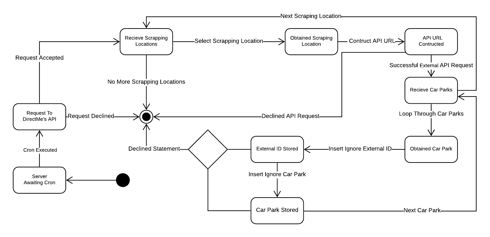
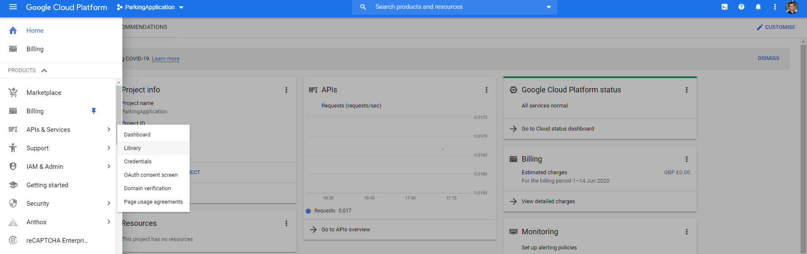
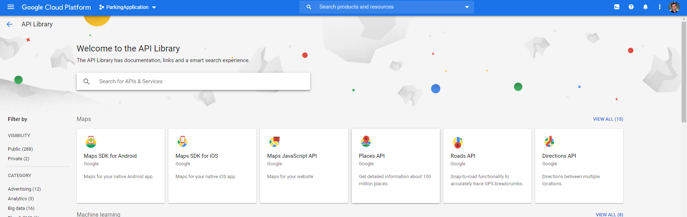
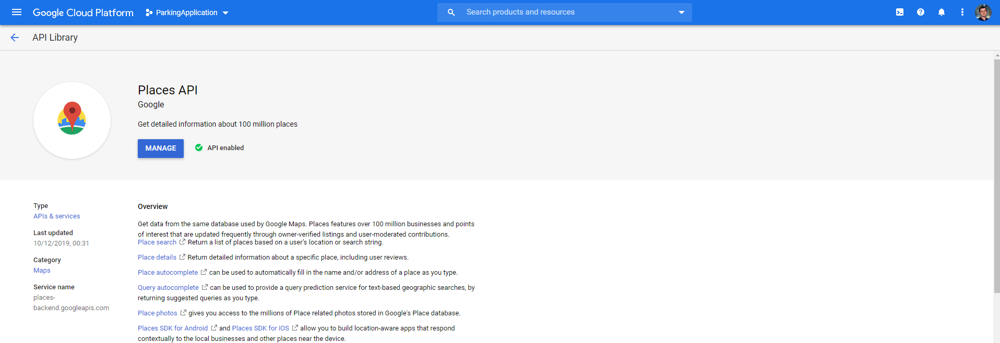
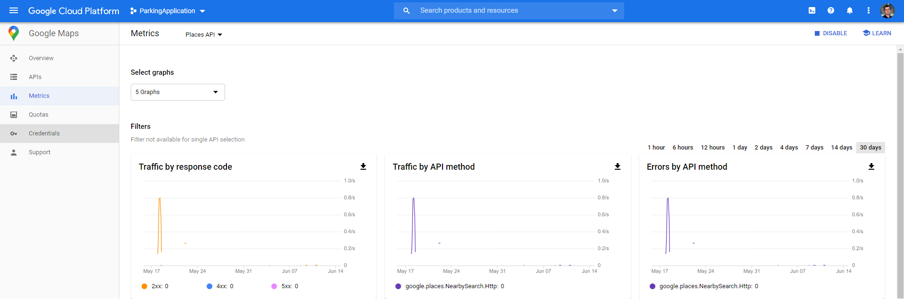
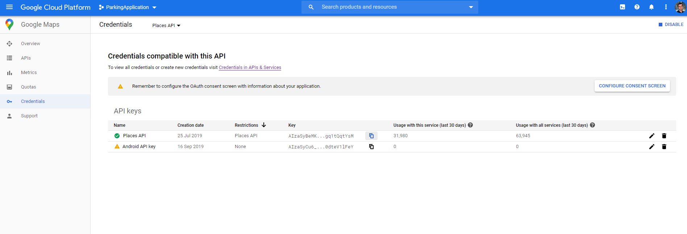
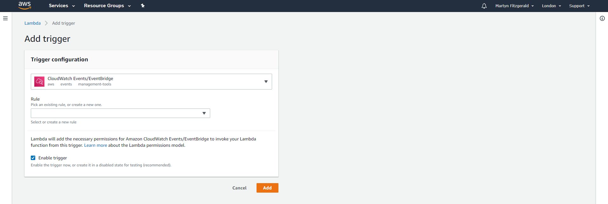

# DirectMe - Worker

The focus behind this final year computing project is to make parking easier, and dynamic for the user. The idea works by using the external data that will be displayed in our application programming interface (API) which will be combined with the user’s information that has been specified previously in the application. This information will then be inserted into an algorithm that will determine what is the best location to park their vehicle within a radius of the postcode, geo-location, or street name given.

This component...

## Editors
* Martyn Fitzgerald - 16025948

## State Transition Diagram

This is a diagram that shows the key of the state transition.

<div align="center">

</div>

This is a diagram that shows how the system shall be used.

<div align="center">

</div>

<hr>

## Software Used

* Node.js
* Visual Studio Code
* Lucidchart
* Amazon Web Services (AWS)

## Setup Environment (Windows/Cloud Services)

1. Install Git (https://gitforwindows.org/).
2. Install Node.js 12+ LTS (https://nodejs.org/en/download/).
3. Create a AWS account, if one doesn't already exist.
4. Setup DirectMe API (https://gitlab.uwe.ac.uk/m4-fitzgerald/DirectMe-API).
5. Create a Google Cloud Platform(GCP) account, if one doesn't already exist.
6. When in the dashboard of GCP, open the menu at top left of the screen and then go to 'APIs & Services' and click on 'Library'.

7. Click on option 'Places API'.

8. Press the button that displays 'Enable' (In the picture it says 'Manage' instead).

9. Press the button that displays 'Credentials'.

10. Press the copy icon next to the text that displays 'Places API'.

11. Paste that endpoint of the API inside dataHandler.js to the new url.
```diff
- Make sure you limit the Google Places quotes on the amount of request are allowed from this API Key. 
```

## Installation

1. Open Command Prompt.
2. Clone the git repository to your computer's workspace.
```bash
git clone https://gitlab.uwe.ac.uk/m4-fitzgerald/DirectMe-Worker.git
```
3. Move into the folder of the repository.
```bash
cd DirectMe-Worker
```
4. Install all dependencies.
```bash
npm install
```
5. Change the endpoint of AWS in apiMethods.js to the one created within the API component.
6. Zip all internal files within the folder DirectMe-Worker. Note: Don't just do the main folder, make sure you highlight all of the files inside! 
7. Sign into AWS Management Console. 
8. Open the 'Services' menu and then select the service 'Lambda' under the sub-menu of 'Compute'.

9. Select option 'Create Function'.

10. Afterwards, it will ask what type of function the environment will be, select 'Author from scratch'.
11. Give the function name a string like 'DirectMe_Worker'.
12. Select runtime as 'Node.js' ^12.x, then select option 'Create function'.

13. Within the environment select 'Actions' under 'Function code' and then select 'Upload a .zip file' then choose the zip file created previously. To upload the environment it may take a few minutes. 

14. In the new environment select 'Triggers'.

15. Within 'Trigger configuration' select a trigger named 'CloudWatch Events/EventBridge'.

16. Add a new rule by selecting 'Create a new rule'.

17. Insert the name of the event and also include a schedule expression by either using cron or rate.
18. Press add to insert the trigger.

