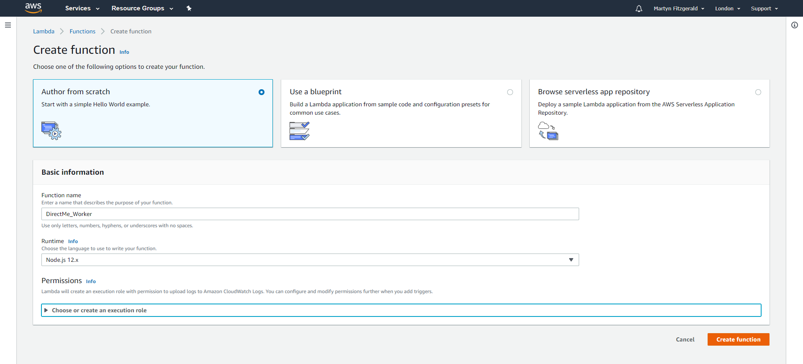
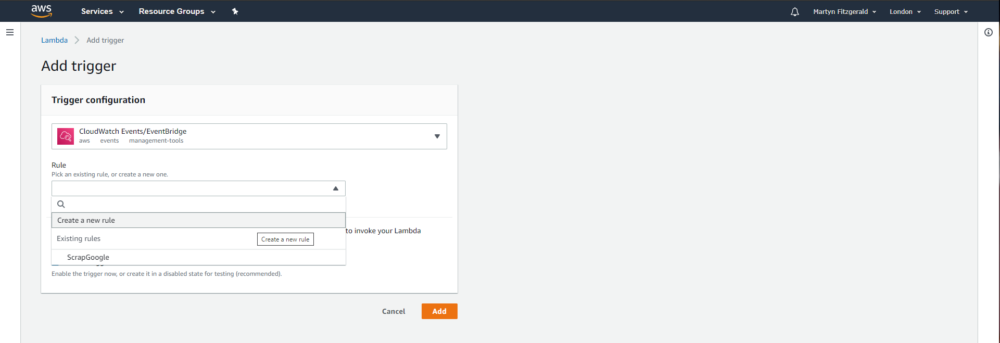

# DirectMe - Worker

The focus behind this final year computing project is to make parking easier, and dynamic for the user. The idea works by using the external data that will be displayed in our application programming interface (API) which will be combined with the user’s information that has been specified previously in the application. This information will then be inserted into an algorithm that will determine what is the best location to park their vehicle within a radius of the postcode, geo-location, or street name given.

This component...

## Editors
* Martyn Fitzgerald - 16025948

## Finite State Diagram

This is a diagram that shows how the system shall be used.

<div align="center">

</div>

<hr>

## Software Used

* Node.js
* Visual Studio Code
* Lucidchart
* Amazon Web Services (AWS)

## Setup Enviroment (Windows/Cloud Services)

1. Install Git (https://gitforwindows.org/).
2. Install Node.js 12+ LTS (https://nodejs.org/en/download/).
3. Setup DirectMe API (https://gitlab.uwe.ac.uk/m4-fitzgerald/DirectMe-API).
4. Create a AWS account, if one does't already exist.

## Installation

1. Open Command Prompt.
2. Clone the git repository to your computer's workspace.
```bash
git clone https://gitlab.uwe.ac.uk/m4-fitzgerald/DirectMe-Worker.git
```
3. Move into the folder of the repository.
```bash
cd DirectMe-Worker
```
4. Install all dependencies.
```bash
npm install
```
5. Change the credentials in dbconnections.js to the ones created within the API component.
6. Zip all internal files within the folder DirectMe-Worker. Note: Don't just do the main folder, make sure you highlight all of the files inside! 
7. Sign into AWS Management Console. 
8. Open the 'Services' Menu and then select the service 'Elastic Beanstalk' under the sub menu of 'Compute'.

9. Select option 'Create a new environment'.

10. Afterwards it will ask what type of tier the environment will be, select 'Web server environment'.

11. Fill in the name of the application and under the section 'Application code'.

12. Select platform as 'Node.js'.

13. Select 'Upload your code' and choose the zip file created previously. Then Create the environment which may take a few minutes. 

14. In the new environment select 'Configuration'.

15. Edit the 'Software'.

16. Insert 'npm start', then apply the settings.

17. Now the worker will be executed every week on Wednesday at 1am.
